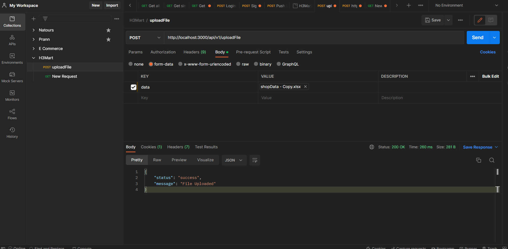
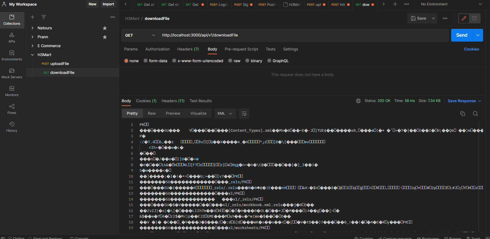
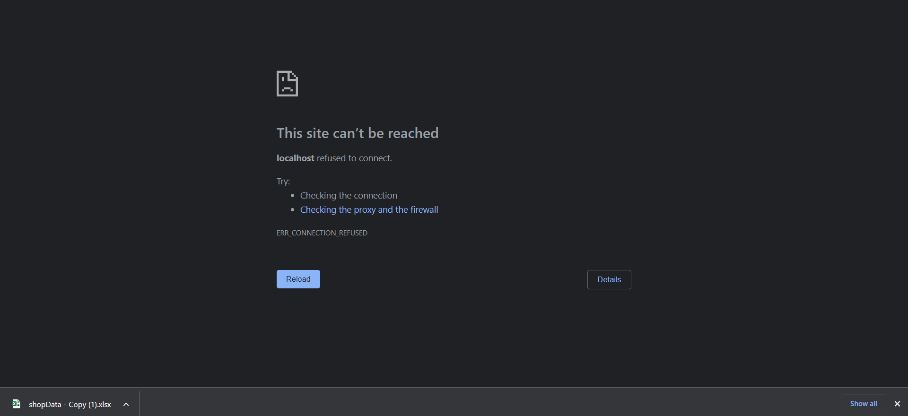
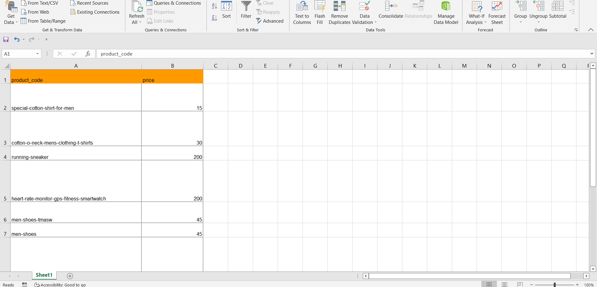

H3Mart Company Assignment

Install the modules: npm install

Start the application: npm run start

_--------------------------------------------------------------------------------_

To Upload File into the application:

Make a POST call to http://localhost:3000/api/v1/uploadFile

Request: POST api/v1/uploadFile

Response:

{
"status": "success",
"message": "File Uploaded"
}

PostMan Request Image : 

_--------------------------------------------------------------------------------_

To Download File into your local system (send the file as response):

Make a GET call to http://localhost:3000/api/v1/downloadFile

Request: GET api/v1/downloadFile

Response: Nil

PostMan Request Image : 

Once you access this request in browser the file will automatically download (Image): 

Excel File After update Image: 

_------------------------------_
Use CTRL+SHIFT+V for readme privew mode
